# Marp Template

## tana-gh

---

# Biography

tana-gh


---

# Content 1

This slide is compiled by Marp.
Structured by following file types...

- Markdown
- SVG
- Image

---

# Content 2

This is source code example.

```haskell
module Main where

main :: IO ()
main = do
    putStrLn "Hello, world!"
```

---

# Content 3

This is SVG example.



---

# Fin.
